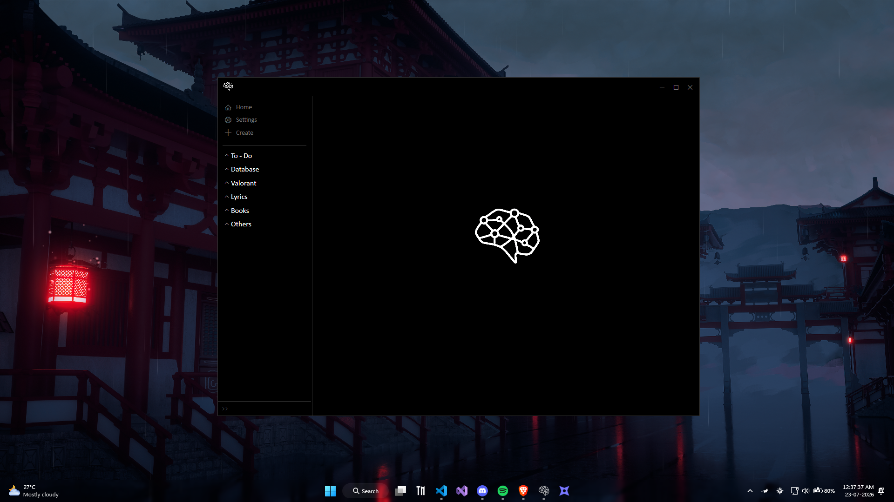
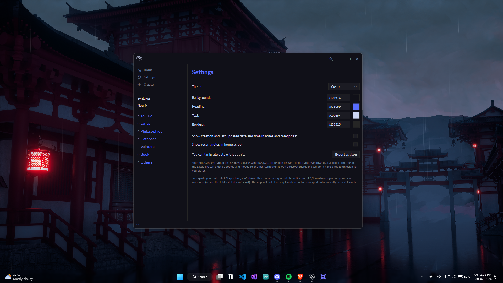
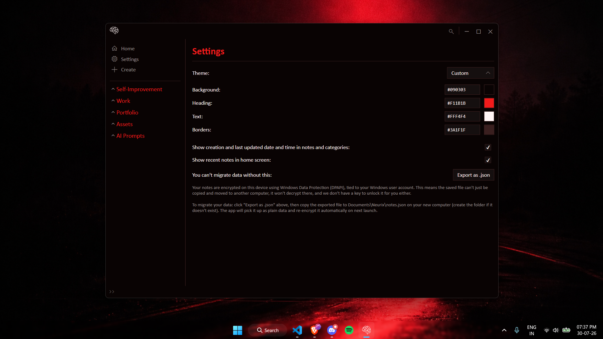

<h1>
  
  Neurix
</h1>

### An offline note-taking application for Windows 10 and 11.

Neurix stores your notes locally on your computer. It doesn't require an internet connection, cloud account, or external database. Notes are stored as Markdown files and can be edited or previewed directly within the application.

  

## Why I made this

I wanted a note-taking application that was lightweight, fast, and fully local. Most note-taking apps either depended on cloud services, felt too heavy, or included features I didn't need. Neurix is my attempt at building something simple that focuses on writing and keeping notes organized while remaining completely offline.

## Current Features

- Write and edit Markdown notes
- Light, dark, and custom themes
- Pin important notes
- Search notes
- Drag and drop images into notes
- Notes encrypted using Windows DPAPI
- Runs completely offline
  
## Supported Syntax

- Headings (`#`, `##`, `###`)
- Bold and italic text (`*italic*`, `**bold**`, `***bold italic***`)
- Underline (`__underline__`)
- Hyperlinks (URLs)
- Links to notes or categories (`/<note-or-category>/`)
- Interactive checklists
  - `/checkbox` + Enter
  - `/checkbox.true`
  - `/checkbox.false`

## Some Custom Themes I Like

<table>
  <tr>
    <th>Preview</th>
    <th>Accent Color</th>
    <th>Background</th>
    <th>Heading</th>
    <th>Text</th>
    <th>Borders</th>
  </tr>

  <tr align="center">
    <td>
      
    </td>
    <td>
      

      <code>Blue</code>
    </td>
    <td>
      

      <code>#101018</code>
    </td>
    <td>
      

      <code>#576CFD</code>
    </td>
    <td>
      

      <code>#CDD6F4</code>
    </td>
    <td>
      

      <code>#252525</code>
    </td>
  </tr>
  <tr align="center">
    <td>
      
    </td>
    <td>
      

      <code>Red</code>
    </td>
    <td>
      

      <code>#090303</code>
    </td>
    <td>
      

      <code>#F11B1B</code>
    </td>
    <td>
      

      <code>#FFF4F4</code>
    </td>
    <td>
      

      <code>#3A1F1F</code>
    </td>
  </tr>
</table>

## Built With

- C#
- .NET 10
- WPF (Windows Presentation Foundation)

## Contributing

If you encounter a bug or have a feature request, you can open an issue in this repository.
